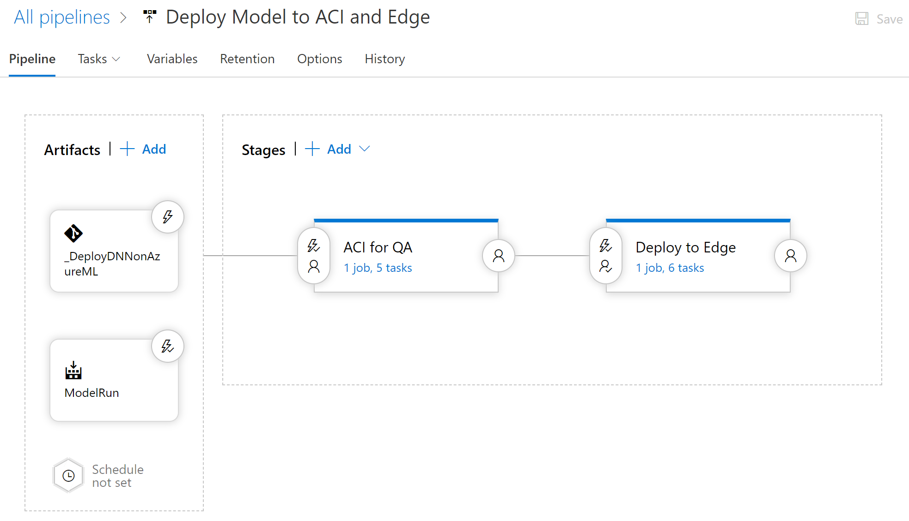

# Introduction 
A sample project to train and deploy, via Azure DevOps, a Deep Learning model used in image classification.

# Technology Used
1. Azure ML Services
1. Azure Databricks
1. Azure DevOps
1. Azure Container Registry
1. Azure Container Instance
1. Azure IoT Hub and Edge Devices

# Setup

1. [Azure DevOps](#azure-devops)
1. [Azure Databricks](#azure-databricks)
1. [Azure IoT Edge Runtime](#azure-iot-edge-runtime)

# Build and Release Script Order

Whether you run this project through Azure DevOps or locally to experiment with Azure ML Services and IoT Edge, you'll need to run the scripts in this order.  I've noted what each file depends on and generates.

## Build
1. `train/DatabricksDNNWrapper.py` calls the `train/DatabricksDNN.py` to train the model.
   * Generates `script-outputs/run.json`
1. `train/ValidateModelScores.py` checks the run's metrics against a threshold file.
   * Uses `script-outputs/run.json`
   * Uses `./threshold.json`
1. `release-service/RegisterModel.py` takes the last run and registers it in the Azure ML Workspace.
   * Uses `script-outputs/run.json`
   * Generates `script-outputs/model.json`
1. `release-service/CreateImage.py` takes the registered model and creates an image.
   * Uses `script-outputs/model.json`
   * Uses `score/score.py` 
   * Generates `score/dependencies.yml`
   * Generates `script-outputs/image.json`

## Release Pipelines

### Release for Web Service

1. `release-service/DeployACI.py` takes the registered model and creates an image.
   * Uses `script-outputs/image.json`
1. **Optionally** use `service/CallACIService.py` to test the model.
   * Uses `tests/data/mnist_test.json` to load pre-processed image data.

### Release for IoT Edge

1. `release-edge\PrepareIOTEdge.py` to create the deployment script for IoT Edge
   * Uses `./iot-edge-template.json` and does a find and replace on several parameters.
1. Run these commands on the az cli

       az login
       az extension add --name azure-cli-iot-ext
       az account set --subscription $subscription_id
       az iot edge set-modules --device-id $iot_device_id --hub-name $iot_hub_name --content deployment.json

1. You've completed the pipeline!

# Setup Details

## Azure DevOps

1. Set up an Azure Service Principal with a contributor role to the resource group you are using.
    * You may want to limit the rights in production applications.
    * The SP will need contributor on at least the Azure ML Service and Container Registry.
1. Create a variable group that stores the environment variables below and link the group to the following pipelines.
1. Create a build pipeline ([details](./docs/build.md)) to train, validate, register, and create an image.
1. Create a release pipeline with two stages.
    * The first stage is a deployment to Azure Container Instances ([details](./docs/release-aci.md)) for QA / Testing.
    * The second stage is a deployment to an Azure IoT Edge device ([details](./docs/release-edge.md)) for production.

### Environment Variables Needed

Set these environment variables whether you're running locally or in Azure DevOps

    set TENANT_ID=
    set APPID=
    set AZUREML_PASSWORD=
    set SUBSCRIPTION=
    set RESOURCE_GROUP=
    set WORKSPACE_NAME=
    set WORKSPACE_LOCATION=
    set EXPERIMENT_NAME=
    set DATABRICKS_TOKEN=
    set DATABRICKS_WORKSPACE=
    set MODEL_NAME=
    set iot_device_id=
    set iot_hub_name=

## Azure Databricks

1. Create a Databricks workspace and record the databricks workspace name.
1. Generate a [Databricks Access Token](https://docs.azuredatabricks.net/api/latest/authentication.html#token-management).
1. Upload the `train/DatabricksDNN.py` as `/dnn/dbr-example` to your databricks workspace.

## Azure IoT Edge Runtime

1. Follow the steps to [Register an IoT Device](https://docs.microsoft.com/en-us/azure/iot-edge/how-to-register-device-portal).
1. Next, with the information from your IoT hub handy, follow the steps to [Install IoT Edge on Linux](https://docs.microsoft.com/en-us/azure/iot-edge/how-to-install-iot-edge-linux).
1. Lastly, take note of the special steps for [Azure ML on IoT Edge](https://docs.microsoft.com/en-us/azure/iot-edge/tutorial-deploy-machine-learning).
   * While the service is in preview, process identification isn't available.
   * Have to add this for management and listening urls to `sudo nano /etc/iotedge/config.yaml` .  
   * Get correct IP Address with `ifconfig` and grab `docker0` interface url.

         connect:
         management_uri: "http://172.17.0.1:15580"
         workload_uri: "http://172.17.0.1:15581"
         listen:
         management_uri: "http://172.17.0.1:15580"
         workload_uri: "http://172.17.0.1:15581"

   * Then you'll have to run `export IOTEDGE_HOST="http://172.17.0.1:15580"`
   * Add the same export to `/etc/environment` to make it permanent.
   * Restart the device `sudo systemctl restart iotedge`

# Troubleshooting

## Docker

### Logging into your Container Registry

    # Assumes you have a service principal with access to the container registry
    docker login --username %APPID% --password %AZUREML_PASSWORD% <YOUR REGISTRY NAME>.azurecr.io

### Pulling a docker container

    docker pull %REGISTRY_NAME%.azurecr.io/%IMAGE_NAME_AND_VERSION%

### Running the container

**Interactive**

    docker run -it %REGISTRY_NAME%.azurecr.io/%IMAGE_NAME_AND_VERSION% /bin/bash

**Run it as a webservice locally** (assumes you're using Linux containers on Windows).  You may have to 1.) Stop all services 2.) Restart Docker with `docker ps -a -q | ForEach { docker stop $_ }` if running on windows by using powershell.

    docker run -d -p 127.0.0.1:8000:5001 %REGISTRY_NAME%.azurecr.io/%IMAGE_NAME_AND_VERSION%

# Alternative Paths

[Azure ML Ops Plugin](https://marketplace.visualstudio.com/items?itemName=ms-air-aiagility.vss-services-azureml&targetId=6fa714f8-629b-4a48-9274-5014c5da9f34)
