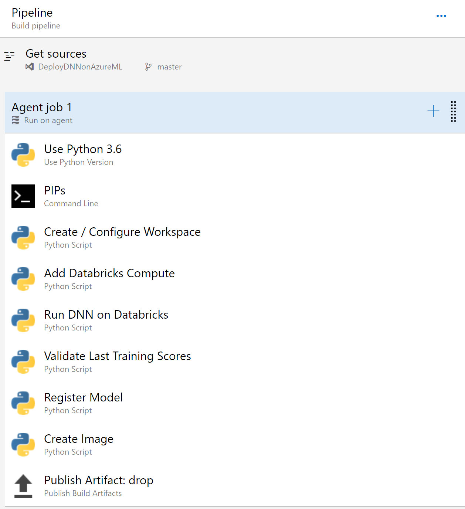

# Build Pipeline Details

This page provides documentation on the flow of the Build pipeline.  Use the below image and YAML text below to fill out your build pipeline.

## Build YAML for Azure DevOps

You can use this yaml file as a reference as you build your DevOps pipeline.

    pool:
    name: Hosted VS2017

    steps:
    - task: UsePythonVersion@0
    displayName: 'Use Python 3.6'
    inputs:
        versionSpec: 3.6

    - script: 'pip install azureml-sdk'
    displayName: PIPs

    - task: PythonScript@0
    displayName: 'Create / Configure Workspace'
    inputs:
        scriptPath: mgmt/Workspace.py

    - task: PythonScript@0
    displayName: 'Add Databricks Compute'
    inputs:
        scriptPath: train/AddDatabricksCompute.py

    - task: PythonScript@0
    displayName: 'Run DNN on Databricks'
    inputs:
        scriptPath: train/DatabricksDNNWrapper.py

    - task: PythonScript@0
    displayName: 'Validate Last Training Scores'
    inputs:
        scriptPath: train/ValidateModelScores.py

    - task: PythonScript@0
    displayName: 'Register Model'
    inputs:
        scriptPath: train/RegisterModel.py

    - task: PythonScript@0
    displayName: 'Create Image'
    inputs:
        scriptPath: train/CreateImage.py

    - task: PublishBuildArtifacts@1
    displayName: 'Publish Artifact: drop'
    inputs:
        PathtoPublish: 'script-outputs'

## Azure DevOps Environment Variable

As a reminder, these variables will need to be set in Azure DevOps.

    APPID
    AZUREML_PASSWORD
    DATABRICKS_TOKEN
    DATABRICKS_WORKSPACE
    EXPERIMENT_NAME
    MODEL_NAME
    RESOURCE_GROUP
    SUBSCRIPTION
    TENANT_ID
    WORKSPACE_LOCATION
    WORKSPACE_NAME
    DEVICE_ID
    HUB_NAME
