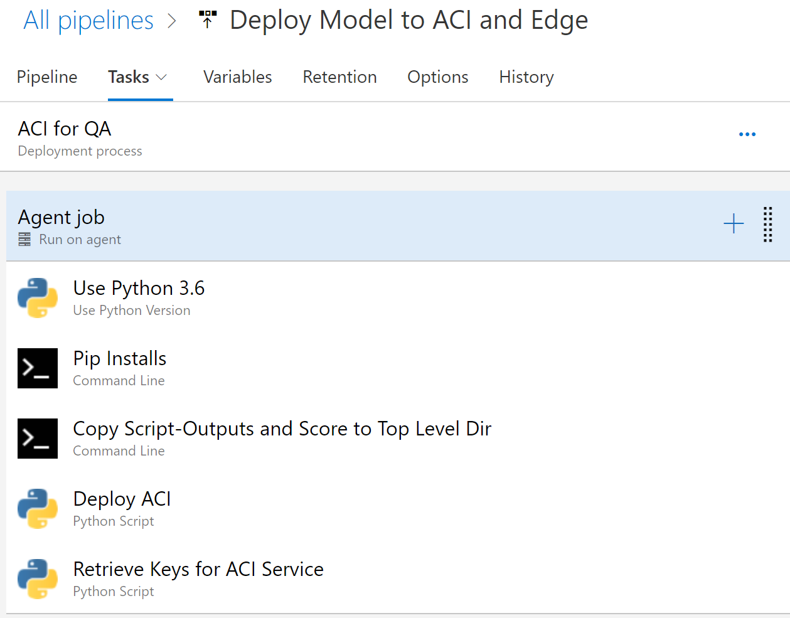

# Release to ACI Pipeline Details

This page provides documentation on the flow of the Release pipeline for the deployment to Azure Container Instances.  Use the below image and YAML text below to fill out your release pipeline.

## Build YAML for Azure DevOps

You can use this yaml file as a reference as you build your DevOps pipeline for the ACI release pipeline.

Two artifacts are used in the overall release pipeline.  The YAML file below uses these names.
1. ModelRun: Name of the published code from the build pipeline.
1. _DeployDNNonAzureML: Alias for the Azure DevOps Git repo.

    steps:
    - task: UsePythonVersion@0
    displayName: 'Use Python 3.6'
    inputs:
        versionSpec: 3.6

    - script: 'pip install azureml-sdk'
    displayName: 'Pip Installs'

    - script: |
    REM /i creates the dir /s copies all sub-dirs too /y suppresses overwrite confirmation prompt
    xcopy $(System.DefaultWorkingDirectory)\ModelRun\drop $(System.DefaultWorkingDirectory)\script-outputs /isy
    xcopy $(System.DefaultWorkingDirectory)\_DeployDNNonAzureML\score $(System.DefaultWorkingDirectory)\score /i
    
    displayName: 'Copy Script-Outputs and Score to Top Level Dir'

    - task: PythonScript@0
    displayName: 'Deploy ACI'
    inputs:
        scriptPath: '$(System.DefaultWorkingDirectory)/_DeployDNNonAzureML/release-service/DeployACI.py'

    - task: PythonScript@0
    displayName: 'Retrieve Keys for ACI Service'
    inputs:
        scriptPath: '$(System.DefaultWorkingDirectory)/_DeployDNNonAzureML/service/GetKeysForService.py'
