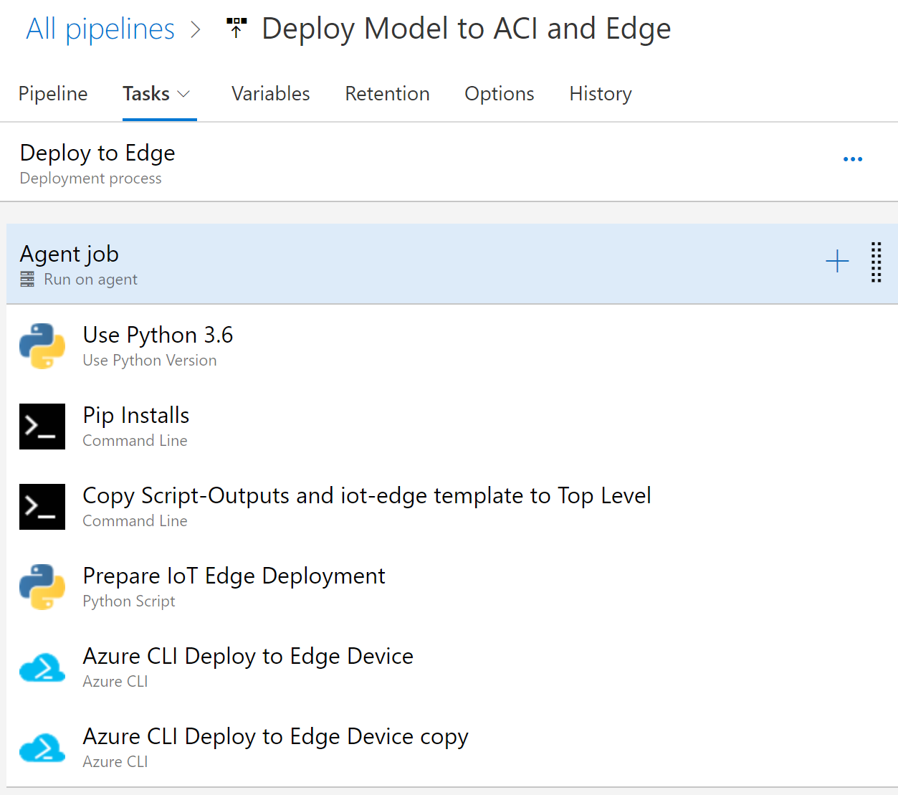

# Release to IoT Edge Pipeline Details

This page provides documentation on the flow of the Release pipeline for the deployment to an IoT Edge device.  Use the below image and YAML text below to fill out your release pipeline.

## Build YAML for Azure DevOps

You can use this yaml file as a reference as you build your DevOps pipeline for the ACI release pipeline.

Two artifacts are used in the overall release pipeline.  The YAML file below uses these names.
1. ModelRun: Name of the published code from the build pipeline.
1. _DeployDNNonAzureML: Alias for the Azure DevOps Git repo.

    steps:
    - task: UsePythonVersion@0
    displayName: 'Use Python 3.6'
    inputs:
        versionSpec: 3.6

    steps:
    - script: 'pip install azureml-sdk'
    displayName: 'Pip Installs'

    steps:
    - script: |
    REM /i creates the dir /s copies all sub-dirs too /y suppresses overwrite confirmation prompt
    xcopy $(System.DefaultWorkingDirectory)\ModelRun\drop $(System.DefaultWorkingDirectory)\script-outputs /isy
    
    REM Copy
    copy $(System.DefaultWorkingDirectory)\_DeployDNNonAzureML\iot-edge-template.json $(System.DefaultWorkingDirectory)\iot-edge-template.json
    displayName: 'Copy  Script-Outputs and iot-edge template  to Top Level'

    steps:
    - task: PythonScript@0
    displayName: 'Prepare IoT Edge Deployment'
    inputs:
        scriptPath: '$(System.DefaultWorkingDirectory)/_DeployDNNonAzureML/release-edge/PrepareIOTEdge.py'

    steps:
    - task: AzureCLI@1
    displayName: 'Azure CLI Deploy to Edge Device'
    inputs:
        azureSubscription: 'Microsoft Azure Internal Consumption (97a44625-84c2-4cba-a587-7d1e95f79a80)'
        scriptLocation: inlineScript
        inlineScript: 'az extension add --name azure-cli-iot-ext'

    steps:
    - task: AzureCLI@1
    displayName: 'Azure CLI Deploy to Edge Device copy'
    inputs:
        azureSubscription: 'Microsoft Azure Internal Consumption (97a44625-84c2-4cba-a587-7d1e95f79a80)'
        scriptLocation: inlineScript
        inlineScript: 'az iot edge set-modules --device-id $(DEVICE_ID) --hub-name $(HUB_NAME) --content $(System.DefaultWorkingDirectory)/script-outputs/deployment.json'
